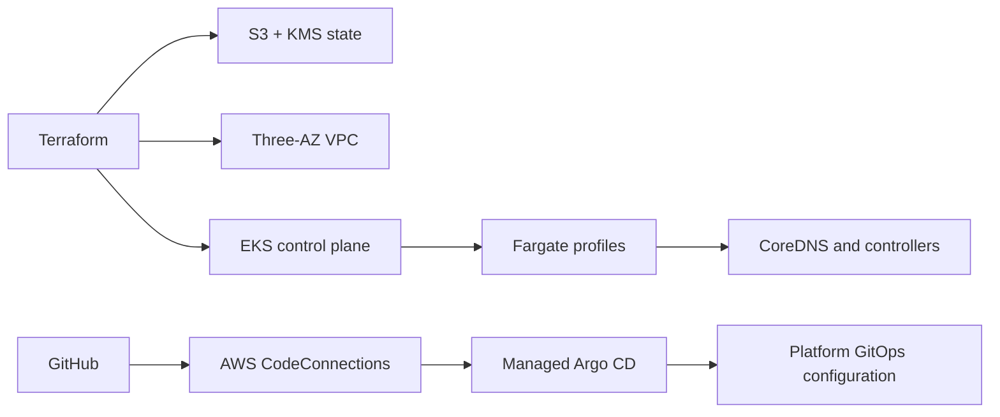

# AWS EKS Fargate Platform Infrastructure

[](LICENSE.md)

Terraform and GitOps blueprint for a serverless Amazon EKS platform running exclusively on AWS Fargate.

> [!IMPORTANT]
> This repository is currently in the design and planning phase. It contains an approved architecture specification and implementation plan; AWS infrastructure, GitOps manifests, and CI workflows have not been implemented yet.

## Overview

The platform is designed to provide one environment named `platform` with:

- A three-Availability-Zone VPC and private Fargate scheduling.
- Amazon EKS with no EC2 node groups, Auto Mode, or Karpenter.
- AWS-managed Argo CD, ACK, and kro EKS Capabilities.
- GitHub as the GitOps source of truth through AWS CodeConnections.
- Terraform-managed S3/KMS remote state using native S3 lockfiles.
- Fargate-compatible logging, metrics, ingress control, and rollout tooling.

Application deployments and post-parity architecture improvements are intentionally handled by separate future plans.

## Target Architecture



Terraform owns customer-controlled AWS resources and the minimum Argo CD bootstrap. Argo CD owns ongoing Kubernetes platform configuration. No resource is intentionally managed by both systems.

## Technology Stack

| Area | Technologies |
| --- | --- |
| Infrastructure | Terraform, AWS Provider, terraform-aws-modules |
| Compute | Amazon EKS 1.35, AWS Fargate |
| GitOps | GitHub, AWS CodeConnections, managed Argo CD |
| Platform | ACK, kro, Argo Rollouts, AWS Load Balancer Controller |
| Observability | CloudWatch Logs, VPC Flow Logs, ADOT |
| Quality | TFLint, Checkov, yamllint, Helm, Kustomize, kubeconform |

## Planned Repository Structure

```text
bootstrap/terraform-state/       Remote-state foundation
environments/platform/          Single deployable Terraform root
modules/                        Reusable platform modules
gitops/platform/                Argo CD-managed platform configuration
gitops/workloads/               Future service manifests
scripts/                        Validation and operational helpers
docs/operations/                Deployment and recovery runbooks
docs/superpowers/specs/         Approved architecture specifications
docs/superpowers/plans/         Step-by-step implementation plans
```

## Prerequisites

Implementation will require:

- An AWS account and configured AWS CLI profile.
- An existing IAM Identity Center instance and user IDs for Argo CD administrators.
- Terraform 1.10 or newer.
- AWS CLI, kubectl, Helm, TFLint, Checkov, yamllint, and kubeconform.
- Authorization to connect this GitHub repository through AWS CodeConnections.

> [!CAUTION]
> Never commit Terraform state, saved plans, backend configuration, variable files containing account data, credentials, or private keys.

## Implementation

Follow the documents in this order:

1. Review the [architecture design](docs/superpowers/specs/2026-07-18-eks-fargate-platform-recreation-design.md).
2. Execute the [start-from-scratch implementation plan](docs/superpowers/plans/2026-07-18-eks-fargate-platform-recreation.md) task by task.
3. Run each task's validation commands before creating its Conventional Commit.
4. Deploy services only through separately approved service plans after platform acceptance passes.

When the planned Make targets exist, run:

```bash
make terraform-check
make yaml-check
```

These commands will remain local and CI quality gates; pull-request workflows will not receive AWS credentials or apply infrastructure.

## GitHub Protection

After the `terraform-ci` and `yaml-ci` workflows have each passed once on `main`, configure a GitHub ruleset for `main` that requires both checks, requires pull requests, and blocks force pushes. This one-time GitHub setting is intentionally not managed through Terraform.
