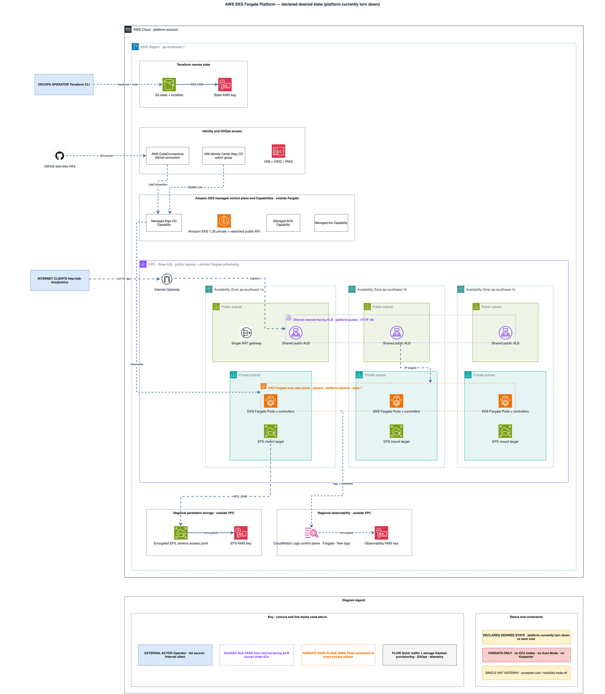
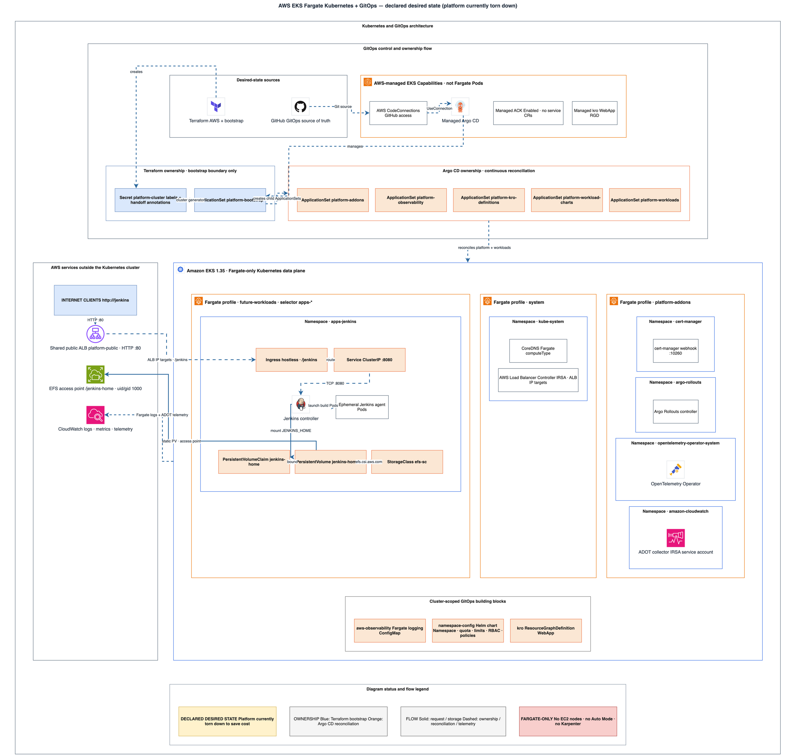

<div align="center">

# AWS EKS Fargate Platform Infrastructure

**Terraform and GitOps blueprint for a serverless Amazon EKS platform running exclusively on AWS Fargate.**

[](https://www.terraform.io/)
[](https://aws.amazon.com/eks/)
[](https://aws.amazon.com/fargate/)
[](https://argo-cd.readthedocs.io/)
[](https://helm.sh/)
[](https://kustomize.io/)
[](https://www.jenkins.io/)
[](.github/workflows)
[](https://www.checkov.io/)
[](LICENSE.md)

</div>

Run `make terraform-check` and `make yaml-check` for static validation. Use the scripts in `scripts/` and the runbooks in `docs/operations/` for deployment, acceptance, drift, and controlled destruction.

## Overview

The repository provides one environment named `platform` with:

- A three-Availability-Zone VPC and private Fargate scheduling.
- Amazon EKS with no EC2 node groups, Auto Mode, or Karpenter.
- AWS-managed Argo CD, ACK, and kro EKS Capabilities.
- GitHub as the GitOps source of truth through AWS CodeConnections.
- Terraform-managed S3/KMS remote state using native S3 lockfiles.
- Fargate-compatible logging, metrics, ingress control, and rollout tooling.
- A shared internet-facing ALB (`platform-public`) that any workload can join by Ingress annotation alone.
- A Jenkins workload on Fargate backed by an encrypted EFS access point.

Further workloads are added through separately approved service plans; the platform itself is at parity.

## Architecture

Both diagrams describe the **declared desired state**. The platform is currently torn down to save cost, so nothing is running in AWS today. Editable sources live beside the renders in [`docs/architecture/`](docs/architecture).

### AWS infrastructure

Account, Region, VPC, managed services, Fargate scheduling, persistent storage, and observability.



### Kubernetes and GitOps

Terraform/Argo CD ownership, the bootstrap handoff, ApplicationSet fan-out, Fargate profiles, namespaces, and the Jenkins runtime.



Terraform owns customer-controlled AWS resources and the minimum Argo CD bootstrap. Argo CD owns ongoing Kubernetes platform configuration. No resource is intentionally managed by both systems.

## Technology Stack

| Area | Technologies |
| --- | --- |
| Infrastructure | Terraform, AWS Provider, terraform-aws-modules |
| Compute | Amazon EKS 1.35, AWS Fargate |
| GitOps | GitHub, AWS CodeConnections, managed Argo CD, Helm, Kustomize |
| Platform | ACK, kro, Argo Rollouts, cert-manager, AWS Load Balancer Controller |
| Networking | Three-AZ VPC, single NAT gateway, shared internet-facing ALB |
| Storage | Amazon EFS access points, AWS KMS, S3 remote state |
| Workloads | Jenkins on Fargate with EFS-backed `JENKINS_HOME` |
| Observability | CloudWatch Logs, VPC Flow Logs, ADOT, OpenTelemetry Operator |
| Quality | TFLint, Checkov, yamllint, Helm, Kustomize, kubeconform, GitHub Actions |

## Repository Structure

```text
aws-eks-infra/
├── bootstrap/
│   └── terraform-state/                 S3 + KMS remote-state foundation (native S3 lockfiles)
├── environments/
│   └── platform/                        The only deployable Terraform root
├── modules/
│   ├── platform_cluster/                VPC, EKS, Fargate profiles, capabilities, IAM, observability
│   │   └── policies/                    JSON IAM policy documents (ALB controller)
│   ├── platform_cluster_bootstrap/      Terraform-to-Argo CD handoff objects
│   └── ack_iam_role_selector/           Namespace-scoped IAM roles for ACK (not yet wired in)
├── gitops/
│   ├── platform/
│   │   ├── bootstrap/                   ApplicationSets Argo CD reconciles first
│   │   ├── config/
│   │   │   ├── addons/                  cert-manager, ALB controller, Argo Rollouts, OTel operator
│   │   │   ├── observability/           Fargate logging ConfigMap and ADOT collector
│   │   │   └── kro-definitions/         kro ResourceGraphDefinitions
│   │   └── charts/
│   │       └── namespace-config/        Namespace, quota, limits, RBAC, NetworkPolicy chart
│   └── workloads/
│       ├── charts/
│       │   └── jenkins-storage/         Static EFS StorageClass, PersistentVolume, and PVC
│       ├── config/charts/               Argo CD Application definitions for workload charts
│       └── manifests/                   Plain workload manifests (empty placeholder)
├── scripts/                             Validation and operational helpers
│   ├── verify-prerequisites.sh          Tool and AWS account preflight
│   ├── verify-platform.sh               Acceptance checks
│   ├── check-drift.sh                   Refresh-only drift detection
│   └── destroy-platform.sh              Guarded teardown
├── docs/
│   ├── architecture/                    Architecture diagrams (.drawio sources + .png renders)
│   ├── operations/                      Deployment, access, observability, and recovery runbooks
│   └── superpowers/
│       ├── specs/                       Approved architecture specifications
│       └── plans/                       Step-by-step implementation plans
├── .github/workflows/                   terraform-ci and yaml-ci quality gates (no AWS credentials)
└── Makefile                             terraform-check, yaml-check, shell-check
```

## Prerequisites

Deployment requires:

- An AWS account and configured AWS CLI profile.
- An existing IAM Identity Center instance and user IDs for Argo CD administrators.
- Terraform 1.10 or newer.
- AWS CLI, kubectl, Helm, TFLint, Checkov, yamllint, and kubeconform.
- Authorization to connect this GitHub repository through AWS CodeConnections.

> [!CAUTION]
> Never commit Terraform state, saved plans, backend configuration, variable files containing account data, credentials, or private keys.

## Deployment

1. Run `./scripts/verify-prerequisites.sh` to confirm tooling and AWS account preconditions.
2. Apply and migrate the state foundation as described in [Terraform state](docs/operations/terraform-state.md).
3. Apply `environments/platform` and authorize the GitHub connection, following [deploy the platform](docs/operations/deploy-platform.md) and [GitHub CodeConnections](docs/operations/github-connection.md).
4. Wait for all three capabilities to report `ACTIVE` per [managed EKS capabilities](docs/operations/capabilities.md), then configure access with [cluster access](docs/operations/cluster-access.md).
5. Run `./scripts/verify-platform.sh` as acceptance, and `./scripts/check-drift.sh` on an ongoing basis.
6. Deploy workloads once acceptance passes — see [deploy Jenkins](docs/operations/deploy-jenkins.md) for the reference workload.

Deploy further services only through separately approved service plans. [Destroying the platform](docs/operations/destroy-platform.md) is a deliberate, guarded procedure.

To reach a workload from the internet, join the shared `platform-public` ALB — see [public workload access](docs/operations/public-workload-access.md). It is HTTP only and open to the world by design.

Before deploying from scratch, read [first deployment defects](docs/operations/first-deployment-defects.md). It records the ten defects found during the first end-to-end deployment — none of which `make terraform-check`, `make yaml-check`, or CI can catch — along with the Argo CD and Fargate invariants they established.

## Validation

```bash
make terraform-check
make yaml-check
```

These are the local and CI quality gates. The `terraform-ci` and `yaml-ci` workflows run the same checks with pinned tool versions; pull-request workflows do not receive AWS credentials and never apply infrastructure. Adding a Terraform root requires updating both `TF_ROOTS` in the `Makefile` and the root list in `.github/workflows/terraform-ci.yaml`.

## Background

The [architecture design](docs/superpowers/specs/2026-07-18-eks-fargate-platform-recreation-design.md) and the [implementation plan](docs/superpowers/plans/2026-07-18-eks-fargate-platform-recreation.md) record the approved decisions this platform was built from.

## GitHub Protection

After the `terraform-ci` and `yaml-ci` workflows have each passed once on `main`, configure a GitHub ruleset for `main` that requires both checks, requires pull requests, and blocks force pushes. This one-time GitHub setting is intentionally not managed through Terraform.
