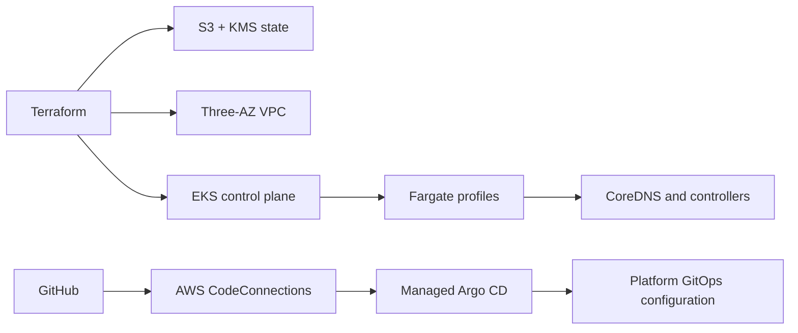

# AWS EKS Fargate Platform Infrastructure

[](LICENSE.md)

Terraform and GitOps blueprint for a serverless Amazon EKS platform running exclusively on AWS Fargate.

Run `make terraform-check` and `make yaml-check` for static validation. Use the scripts in `scripts/` and the runbooks in `docs/operations/` for deployment, acceptance, drift, and controlled destruction.

## Overview

The repository provides one environment named `platform` with:

- A three-Availability-Zone VPC and private Fargate scheduling.
- Amazon EKS with no EC2 node groups, Auto Mode, or Karpenter.
- AWS-managed Argo CD, ACK, and kro EKS Capabilities.
- GitHub as the GitOps source of truth through AWS CodeConnections.
- Terraform-managed S3/KMS remote state using native S3 lockfiles.
- Fargate-compatible logging, metrics, ingress control, and rollout tooling.

Application deployments and post-parity architecture improvements are intentionally handled by separate future plans.

## Architecture



Terraform owns customer-controlled AWS resources and the minimum Argo CD bootstrap. Argo CD owns ongoing Kubernetes platform configuration. No resource is intentionally managed by both systems.

## Technology Stack

| Area | Technologies |
| --- | --- |
| Infrastructure | Terraform, AWS Provider, terraform-aws-modules |
| Compute | Amazon EKS 1.35, AWS Fargate |
| GitOps | GitHub, AWS CodeConnections, managed Argo CD |
| Platform | ACK, kro, Argo Rollouts, AWS Load Balancer Controller |
| Observability | CloudWatch Logs, VPC Flow Logs, ADOT |
| Quality | TFLint, Checkov, yamllint, Helm, Kustomize, kubeconform |

## Repository Structure

```text
bootstrap/terraform-state/           Remote-state foundation
environments/platform/              Single deployable Terraform root
modules/platform_cluster/           VPC, EKS, Fargate profiles, capabilities, IAM, observability
modules/platform_cluster_bootstrap/ Terraform-to-Argo CD handoff objects
modules/ack_iam_role_selector/      Namespace-scoped IAM roles for ACK
gitops/platform/bootstrap/          ApplicationSets Argo CD reconciles first
gitops/platform/config/             Addons, observability, and kro definitions
gitops/platform/charts/             Platform Helm charts
gitops/workloads/                   Future service manifests
scripts/                            Validation and operational helpers
docs/operations/                    Deployment and recovery runbooks
docs/superpowers/specs/             Approved architecture specifications
docs/superpowers/plans/             Step-by-step implementation plans
```

## Prerequisites

Deployment requires:

- An AWS account and configured AWS CLI profile.
- An existing IAM Identity Center instance and user IDs for Argo CD administrators.
- Terraform 1.10 or newer.
- AWS CLI, kubectl, Helm, TFLint, Checkov, yamllint, and kubeconform.
- Authorization to connect this GitHub repository through AWS CodeConnections.

> [!CAUTION]
> Never commit Terraform state, saved plans, backend configuration, variable files containing account data, credentials, or private keys.

## Deployment

1. Run `./scripts/verify-prerequisites.sh` to confirm tooling and AWS account preconditions.
2. Apply and migrate the state foundation as described in [Terraform state](docs/operations/terraform-state.md).
3. Apply `environments/platform` and authorize the GitHub connection, following [deploy the platform](docs/operations/deploy-platform.md) and [GitHub CodeConnections](docs/operations/github-connection.md).
4. Wait for all three capabilities to report `ACTIVE` per [managed EKS capabilities](docs/operations/capabilities.md), then configure access with [cluster access](docs/operations/cluster-access.md).
5. Run `./scripts/verify-platform.sh` as acceptance, and `./scripts/check-drift.sh` on an ongoing basis.

Deploy services only through separately approved service plans after platform acceptance passes. [Destroying the platform](docs/operations/destroy-platform.md) is a deliberate, guarded procedure.

To give a workload a public DNS name with TLS, follow [public workload access](docs/operations/public-workload-access.md).

Before deploying from scratch, read [first deployment defects](docs/operations/first-deployment-defects.md). It records the ten defects found during the first end-to-end deployment — none of which `make terraform-check`, `make yaml-check`, or CI can catch — along with the Argo CD and Fargate invariants they established.

## Validation

```bash
make terraform-check
make yaml-check
```

These are the local and CI quality gates. The `terraform-ci` and `yaml-ci` workflows run the same checks with pinned tool versions; pull-request workflows do not receive AWS credentials and never apply infrastructure. Adding a Terraform root requires updating both `TF_ROOTS` in the `Makefile` and the root list in `.github/workflows/terraform-ci.yaml`.

## Background

The [architecture design](docs/superpowers/specs/2026-07-18-eks-fargate-platform-recreation-design.md) and the [implementation plan](docs/superpowers/plans/2026-07-18-eks-fargate-platform-recreation.md) record the approved decisions this platform was built from.

## GitHub Protection

After the `terraform-ci` and `yaml-ci` workflows have each passed once on `main`, configure a GitHub ruleset for `main` that requires both checks, requires pull requests, and blocks force pushes. This one-time GitHub setting is intentionally not managed through Terraform.
