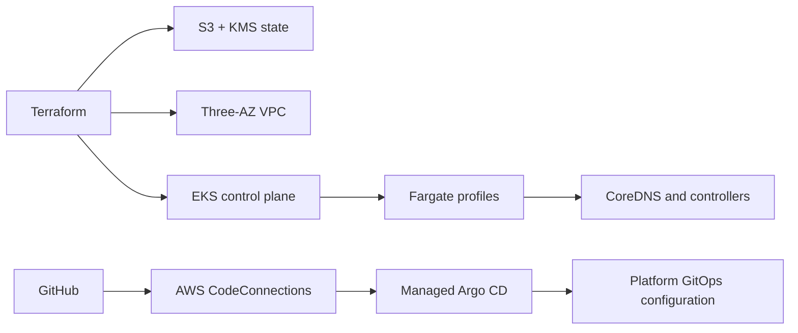

# Repository Metadata Implementation Plan

> **For agentic workers:** REQUIRED SUB-SKILL: Use superpowers:subagent-driven-development (recommended) or superpowers:executing-plans to implement this plan task-by-task. Steps use checkbox (`- [ ]`) syntax for tracking.

**Goal:** Add accurate project documentation, an Apache-2.0 license, and safe Terraform ignore rules to the repository root, then publish the focused commit to `origin/main`.

**Architecture:** `README.md` is the operator-facing entry point and links to the detailed design and implementation plan. `LICENSE.md` contains the authoritative Apache License 2.0 terms and the approved copyright notice. `.gitignore` blocks generated, local, and sensitive infrastructure artifacts while retaining dependency lock files and examples.

**Tech Stack:** GitHub Flavored Markdown, Apache License 2.0, Git, Terraform artifact conventions.

## Global Constraints

- Describe the EKS Fargate platform as planned, not already implemented or deployed.
- Do not add application deployment instructions or claim that CI workflows or AWS resources exist.
- Use `Copyright 2026 Huy Nguyen` and unmodified Apache License 2.0 terms.
- Keep `.terraform.lock.hcl`, `*.example`, and documentation files trackable.
- Include only `README.md`, `LICENSE.md`, and `.gitignore` in the implementation commit.
- Push the current `main` branch directly to `origin/main`; do not create a pull request.

---

### Task 1: Add and Publish Repository Metadata

**Files:**
- Create: `README.md`
- Create: `LICENSE.md`
- Create: `.gitignore`

**Interfaces:**
- Consumes: `docs/superpowers/specs/2026-07-18-eks-fargate-platform-recreation-design.md`, `docs/superpowers/plans/2026-07-18-eks-fargate-platform-recreation.md`, and the official Apache License 2.0 text.
- Produces: the repository landing page, licensing terms, and local artifact-safety policy.

- [ ] **Step 1: Create the operator-facing README**

Create `README.md` with this exact content:

````markdown
# AWS EKS Fargate Platform Infrastructure

[](LICENSE.md)

Terraform and GitOps blueprint for a serverless Amazon EKS platform running exclusively on AWS Fargate.

> [!IMPORTANT]
> This repository is currently in the design and planning phase. It contains an approved architecture specification and implementation plan; AWS infrastructure, GitOps manifests, and CI workflows have not been implemented yet.

## Overview

The platform is designed to provide one environment named `platform` with:

- A three-Availability-Zone VPC and private Fargate scheduling.
- Amazon EKS with no EC2 node groups, Auto Mode, or Karpenter.
- AWS-managed Argo CD, ACK, and kro EKS Capabilities.
- GitHub as the GitOps source of truth through AWS CodeConnections.
- Terraform-managed S3/KMS remote state using native S3 lockfiles.
- Fargate-compatible logging, metrics, ingress control, and rollout tooling.

Application deployments and post-parity architecture improvements are intentionally handled by separate future plans.

## Target Architecture



Terraform owns customer-controlled AWS resources and the minimum Argo CD bootstrap. Argo CD owns ongoing Kubernetes platform configuration. No resource is intentionally managed by both systems.

## Technology Stack

| Area | Technologies |
| --- | --- |
| Infrastructure | Terraform, AWS Provider, terraform-aws-modules |
| Compute | Amazon EKS 1.35, AWS Fargate |
| GitOps | GitHub, AWS CodeConnections, managed Argo CD |
| Platform | ACK, kro, Argo Rollouts, AWS Load Balancer Controller |
| Observability | CloudWatch Logs, VPC Flow Logs, ADOT |
| Quality | TFLint, Checkov, yamllint, Helm, Kustomize, kubeconform |

## Planned Repository Structure

```text
bootstrap/terraform-state/       Remote-state foundation
environments/platform/          Single deployable Terraform root
modules/                        Reusable platform modules
gitops/platform/                Argo CD-managed platform configuration
gitops/workloads/               Future service manifests
scripts/                        Validation and operational helpers
docs/operations/                Deployment and recovery runbooks
docs/superpowers/specs/         Approved architecture specifications
docs/superpowers/plans/         Step-by-step implementation plans
```

## Prerequisites

Implementation will require:

- An AWS account and configured AWS CLI profile.
- An existing IAM Identity Center instance and user IDs for Argo CD administrators.
- Terraform 1.10 or newer.
- AWS CLI, kubectl, Helm, TFLint, Checkov, yamllint, and kubeconform.
- Authorization to connect this GitHub repository through AWS CodeConnections.

> [!CAUTION]
> Never commit Terraform state, saved plans, backend configuration, variable files containing account data, credentials, or private keys.

## Implementation

Follow the documents in this order:

1. Review the [architecture design](docs/superpowers/specs/2026-07-18-eks-fargate-platform-recreation-design.md).
2. Execute the [start-from-scratch implementation plan](docs/superpowers/plans/2026-07-18-eks-fargate-platform-recreation.md) task by task.
3. Run each task's validation commands before creating its Conventional Commit.
4. Deploy services only through separately approved service plans after platform acceptance passes.

When the planned Make targets exist, run:

```bash
make terraform-check
make yaml-check
```

These commands will remain local and CI quality gates; pull-request workflows will not receive AWS credentials or apply infrastructure.
````

- [ ] **Step 2: Create the Apache-2.0 license**

Create `LICENSE.md` from the exact text served by `https://www.apache.org/licenses/LICENSE-2.0.txt`. Preserve Sections 1–9 and the Appendix without alteration. Add this project notice before the license heading:

```text
Copyright 2026 Huy Nguyen

```

Verify that the file contains these anchors exactly once:

```text
Apache License
Version 2.0, January 2004
TERMS AND CONDITIONS FOR USE, REPRODUCTION, AND DISTRIBUTION
END OF TERMS AND CONDITIONS
APPENDIX: How to apply the Apache License to your work.
```

- [ ] **Step 3: Add Terraform-safe ignore rules**

Create `.gitignore` with this exact content:

```gitignore
# Terraform working directories and state
**/.terraform/*
*.tfstate
*.tfstate.*
*.tflock

# Terraform plans and crash logs
*.tfplan
*tfplan*
crash.log
crash.*.log

# Local Terraform configuration and sensitive values
backend.hcl
*.tfvars
*.tfvars.json
!*.tfvars.example
!*.tfvars.json.example
.terraformrc
terraform.rc
override.tf
override.tf.json
*_override.tf
*_override.tf.json

# Environment files and credentials
.env
.env.*
!.env.example
*.pem
*.key
*.p12
kubeconfig
kubeconfig.*

# Editors and operating systems
.idea/
.vscode/
*.swp
*.swo
*~
.DS_Store
Thumbs.db

# Temporary files
.cache/
tmp/
*.tmp
```

Do not add `.terraform.lock.hcl`; provider dependency locks must be committed.

- [ ] **Step 4: Verify content and scope**

Run:

```bash
test -f README.md
test -f LICENSE.md
test -f .gitignore
rg -n '^# |^## ' README.md
rg -n 'Apache License|Version 2.0|Copyright 2026 Huy Nguyen' LICENSE.md
git check-ignore terraform.tfstate terraform.tfplan backend.hcl terraform.tfvars .env private.key kubeconfig
if git check-ignore -q .terraform.lock.hcl; then
  exit 1
fi
git diff --check
git status --short
```

Expected: all requested files exist; the README headings are present; license anchors are found; every sensitive sample path is ignored; `.terraform.lock.hcl` is not ignored; whitespace validation succeeds; no unrelated file is modified.

- [ ] **Step 5: Commit the three files**

```bash
git add README.md LICENSE.md .gitignore
git diff --cached --name-only
git commit -m "docs: add repository overview and license"
```

Expected staged paths before commit, in Git's output order:

```text
.gitignore
LICENSE.md
README.md
```

- [ ] **Step 6: Verify and push**

```bash
git show --check --stat --oneline HEAD
git status --short
git push -u origin main
git status -sb
```

Expected: the commit contains only the three requested files, the worktree is clean, the push succeeds, and local `main` tracks `origin/main` without divergence.
