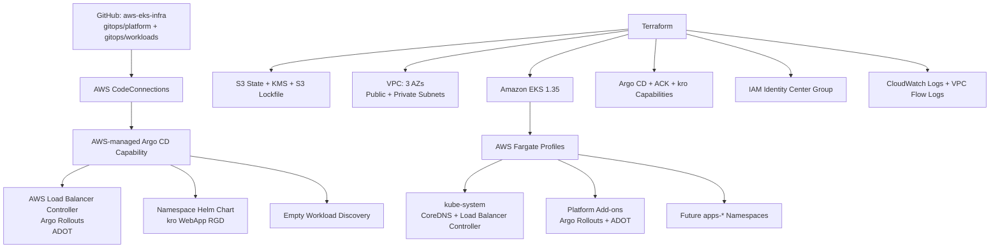

# EKS Fargate Platform Recreation Design

## Context

The `aws-eks-infra` repository will recreate the platform-engineering architecture demonstrated by `sample-platform-engineering-on-eks`, but with a pure AWS Fargate data plane and GitHub as the GitOps source of truth. The repository begins empty. It will contain infrastructure code, GitOps platform configuration, quality gates, and operating documentation; it will not deploy a sample or business service.

The first delivery creates one environment named `platform`. Service deployments and post-parity architectural improvements are separate future plans. Essential correctness and portability fixes are included now: remote state, parameterized naming and Region configuration, deterministic dependency gates, GitHub authentication without long-lived credentials, and Fargate-compatible replacements for Auto Mode-only components.

## Goals

- Provision a three-AZ Amazon EKS cluster whose Pods run only on AWS Fargate.
- Manage every customer-controlled AWS resource introduced by this repository with Terraform wherever the AWS API and provider permit it.
- Use AWS-managed EKS Capabilities for Argo CD, ACK, and kro.
- Use the existing `HuyNguyen260398/aws-eks-infra` GitHub repository as the single GitOps source of truth.
- Authenticate managed Argo CD to GitHub through AWS CodeConnections.
- Install the platform controllers and configuration through Argo CD without deploying an application.
- Store Terraform state in a protected S3 backend using native S3 state lockfiles.
- Enforce Terraform/HCL and YAML/GitOps quality gates in GitHub Actions.
- Make every implementation task independently reviewable, verifiable, and committed.

## Non-Goals

- Deploying `bg-demo`, `distribution-monitor`, or any other service.
- Creating service namespaces, load balancers, workload storage, ECR repositories, or service IAM permissions.
- Supporting multiple environments such as development, staging, and production.
- Preserving EKS Auto Mode, EC2 node groups, Karpenter NodePools, or node-level DaemonSets.
- Implementing later improvements such as multi-account topology, multi-Region recovery, private-only cluster access, VPC endpoints, per-AZ NAT gateways, policy-as-code admission controls, or service-specific observability.

## Architecture



The control plane is managed Amazon EKS. Argo CD, ACK, and kro run as EKS Capabilities in AWS-managed infrastructure rather than consuming Fargate capacity. CoreDNS and in-cluster controllers run as ordinary Pods on Fargate. No managed node group, self-managed node, Auto Scaling group, or EKS Auto Mode compute configuration exists.

## Repository Structure

```text
aws-eks-infra/
├── .github/workflows/
│   ├── terraform-ci.yaml
│   └── yaml-ci.yaml
├── bootstrap/terraform-state/
├── environments/platform/
├── modules/
│   ├── platform_cluster/
│   ├── platform_cluster_bootstrap/
│   └── ack_iam_role_selector/
├── gitops/
│   ├── platform/
│   │   ├── bootstrap/
│   │   ├── charts/namespace-config/
│   │   └── config/
│   │       ├── addons/
│   │       ├── observability/
│   │       └── kro-definitions/
│   └── workloads/README.md
├── scripts/
├── docs/operations/
├── docs/superpowers/specs/
├── docs/superpowers/plans/
├── .checkov.yml
├── .tflint.hcl
├── .yamllint.yml
├── .gitignore
├── Makefile
└── README.md
```

`bootstrap/terraform-state` owns only the remote-state foundation. `environments/platform` is the only deployable cluster root. Modules remain environment-agnostic even though creating additional environment roots is deferred. `gitops/platform` contains cluster platform configuration reconciled by Argo CD; `gitops/workloads` is intentionally empty until later service plans.

## Terraform State Foundation

The state bootstrap creates a globally unique S3 bucket based on the project prefix, AWS account ID, and Region. Terraform manages:

- A customer-managed symmetric KMS key and alias.
- S3 bucket versioning.
- Default SSE-KMS encryption.
- S3 Block Public Access.
- A bucket policy denying non-TLS requests and incorrectly encrypted writes.
- Lifecycle protection with `prevent_destroy` and `force_destroy = false`.

The bootstrap begins with local state because its backend does not yet exist. After the first apply, its state is migrated to `bootstrap/terraform.tfstate` in the new bucket. The platform root uses `platform/terraform.tfstate`. Both use `use_lockfile = true`; DynamoDB locking is not used. Backend values are supplied through ignored `backend.hcl` files copied from committed examples. Credentials are sourced from the AWS CLI/shared configuration or environment, never committed.

## Network Design

Terraform creates a VPC across three available Availability Zones. Each AZ receives one public and one private subnet. Fargate profiles use private subnets only. Public subnets support internet-facing load balancers introduced by later service plans. A single NAT gateway preserves the source architecture's initial cost profile; multi-AZ NAT is explicitly deferred.

The EKS API endpoint enables private access and CIDR-restricted public access. Private access is mandatory so Fargate Pods can reach the Kubernetes API without relying on the configured public CIDRs. VPC Flow Logs publish to a Terraform-managed, KMS-encrypted CloudWatch log group using a Terraform-managed IAM role.

## EKS Fargate Design

The platform uses Kubernetes `1.35`, Terraform AWS Provider `~> 6.0`, `terraform-aws-modules/eks/aws ~> 21.0`, and `terraform-aws-modules/vpc/aws ~> 6.0`. Terraform itself must support native S3 lockfiles. Exact compatible patch versions are committed in dependency lock files during implementation.

Terraform creates the EKS cluster, cluster IAM role, security groups, access entries, OIDC provider, Fargate Pod execution role, and Fargate profiles. Auto Mode is disabled and no node groups are configured. CoreDNS is configured for Fargate scheduling.

Profiles establish these scheduling contracts:

- `system`: selects `kube-system` for CoreDNS and AWS Load Balancer Controller.
- `platform-addons`: selects `argo-rollouts`, `opentelemetry-operator-system`, and `amazon-cloudwatch`.
- `future-workloads`: selects namespaces matching `apps-*`, establishing the naming contract for later service plans.

Fargate limitations are architectural constraints: no privileged Pods, host networking, host ports, DaemonSets, or direct node access. Future ingress must use ALB IP targets. Persistent storage design is deferred to each service plan.

## Identity and GitHub Authentication

An IAM Identity Center instance is an account/organization prerequisite and is discovered with `data.aws_ssoadmin_instances`. Terraform creates a dedicated Argo CD administrator group and group memberships from a required list of existing Identity Store user IDs. The Argo CD capability maps this group to its built-in `ADMIN` role. Organization users and the Identity Center instance itself remain account-foundation resources outside this repository.

Terraform creates `aws_codeconnections_connection` with provider type `GitHub`. AWS creates it in `PENDING`; an operator completes the one-time GitHub authorization in the AWS console. Terraform continues to own the connection after it becomes `AVAILABLE`. The Argo CD capability role receives only `codeconnections:UseConnection` and `codeconnections:GetConnection` for that connection ARN.

Applications use the AWS CodeConnections Git HTTP endpoint for `HuyNguyen260398/aws-eks-infra`, branch `main`, and repository paths under `gitops/`. No PAT, SSH private key, GitHub App key, GitHub provider, or GitHub credential is stored in Git, Kubernetes, or Terraform state.

## Managed EKS Capabilities

Terraform creates separate trust roles and capability resources for Argo CD, ACK, and kro. It waits on observable capability status rather than fixed sleep alone before applying capability CRDs.

- Argo CD manages the local cluster and reads GitHub through CodeConnections.
- ACK is enabled but receives no service-specific AWS permissions or custom resources in this plan.
- kro is enabled and receives the Kubernetes access required to manage ResourceGraphDefinitions and generated resources.

The reusable `ack_iam_role_selector` module is implemented but not instantiated. Later service plans use it to grant namespace- and resource-type-scoped permissions.

## GitOps Platform Configuration

Terraform registers the cluster and creates only the root Argo CD ApplicationSet. The root points to `gitops/platform/bootstrap` and creates child Applications/ApplicationSets for platform add-ons, observability, namespace configuration, kro definitions, and workload discovery.

Argo CD installs:

- AWS Load Balancer Controller with an IRSA role fully managed by Terraform. Helm values provide explicit cluster name, Region, and VPC ID because the controller runs on Fargate.
- Argo Rollouts as a standard Deployment in `argo-rollouts`.
- AWS Distro for OpenTelemetry components supported on Fargate, with Terraform-managed IRSA permissions and CloudWatch destinations.
- The `aws-observability` namespace and Fargate logging ConfigMap targeting a pre-created CloudWatch log group.
- The namespace bootstrap Helm chart supporting Namespace, ResourceQuota, LimitRange, NetworkPolicy, Role, and RoleBinding resources.
- The kro `WebApp` ResourceGraphDefinition updated for Fargate-compatible ALB IP targeting.

No namespace chart release, WebApp instance, Rollout, Service, Ingress, or ACK service custom resource is created by this plan. Workload discovery safely allows an empty directory.

## Observability

The source architecture's CloudWatch Observability and Network Flow Monitor agents do not support a pure Fargate-only data plane. They are replaced with supported mechanisms:

- EKS control-plane audit, API, authenticator, controller-manager, and scheduler logs.
- VPC Flow Logs for network-level visibility.
- Fargate-native log routing to CloudWatch Logs.
- ADOT for Fargate-compatible Container Insights and telemetry collection.

Terraform owns KMS keys, log groups, retention settings, IAM policies, IRSA roles, and VPC Flow Log resources. GitOps owns only the Kubernetes collector and logging configuration. Service-level instrumentation, dashboards, alarms, and SLOs belong to future service or improvement plans.

## CI Quality Gates

`.github/workflows/terraform-ci.yaml` runs for Terraform-related changes and enforces:

- `terraform fmt -check -recursive`.
- Backend-disabled initialization and `terraform validate` for roots and modules.
- TFLint initialization and recursive linting.
- Checkov scanning of Terraform configuration.

`.github/workflows/yaml-ci.yaml` runs for YAML, Helm, Kustomize, and GitOps changes and enforces:

- yamllint using repository configuration.
- Helm linting and deterministic template rendering.
- Kustomize rendering for every overlay.
- kubeconform validation of rendered resources, with explicit handling for custom-resource schemas.

Workflows use least privilege (`contents: read`), pinned action versions, concurrency cancellation, and path filters. Pull-request workflows do not receive AWS credentials and never run `terraform plan` or `apply`. Both checks are made required for `main` through a documented one-time GitHub repository ruleset configuration.

## Provisioning and Dependency Flow

1. Validate local tools, AWS identity, Region support, Identity Center users, GitHub repository access, and input CIDRs.
2. Apply the state bootstrap and migrate its state to S3.
3. Initialize the platform root with its S3 backend.
4. Create CodeConnections, complete GitHub authorization, and verify `AVAILABLE`.
5. Create networking, logging, EKS, OIDC, roles, and Fargate profiles.
6. Verify CoreDNS is running on Fargate and the cluster has no EC2 worker capacity.
7. Create and verify the three managed EKS Capabilities.
8. Register the local cluster and create the root ApplicationSet.
9. Wait for all Argo CD platform Applications to become `Synced` and `Healthy`.
10. Run acceptance checks and a final no-change Terraform plan.

Each gate is resumable and idempotent. A failed CodeConnections authorization, inactive capability, unavailable CRD, unschedulable controller, or unhealthy Argo CD Application stops the sequence before dependent resources are applied.

## Resource Ownership Boundaries

Every customer-controlled AWS resource introduced by this plan is represented in Terraform. Documented exceptions are:

- The existing AWS account, Organizations configuration, IAM Identity Center instance, and Identity Store users.
- The existing GitHub repository and the human GitHub authorization handshake for CodeConnections.
- EKS and Fargate service-managed runtime resources, including Fargate compute infrastructure and transient ENIs.
- Future ALBs and related target groups created declaratively by AWS Load Balancer Controller in response to service manifests.

Kubernetes resources follow a deliberate split: Terraform owns the minimum bootstrap objects that must exist before GitOps; Argo CD owns all ongoing platform Kubernetes configuration. The same resource is never owned by both systems.

## Failure Recovery and Destruction

Native S3 lockfiles prevent concurrent Terraform mutation, and S3 versioning provides state recovery. Terraform applies use reviewed saved plans for material infrastructure changes. Capability readiness and Argo CD health checks replace timing assumptions.

Destruction reverses dependency order: remove future workloads, disable workload discovery, remove GitOps Applications, remove Terraform bootstrap objects, delete EKS Capabilities, delete the EKS cluster and VPC, and retain the state backend. The KMS key and state bucket require a separate, explicit break-glass procedure and are not removed by the normal platform destroy workflow.

## Acceptance Criteria

- Both GitHub Actions quality workflows pass and are required on `main`.
- The state bootstrap and platform roots use separate S3 state keys with lockfiles.
- CodeConnections is Terraform-managed and reports `AVAILABLE`.
- EKS is `ACTIVE`, has private endpoint access, and restricts public endpoint access to configured CIDRs.
- No EC2 node group, Auto Mode compute, Karpenter controller, or worker instance is part of the desired architecture.
- All Fargate profiles are `ACTIVE`; CoreDNS and platform controller Pods run on Fargate.
- Argo CD, ACK, and kro capabilities are `ACTIVE`.
- AWS Load Balancer Controller, Argo Rollouts, and ADOT are healthy.
- Argo CD reports platform Applications `Synced` and `Healthy` from GitHub through CodeConnections.
- No application namespace, service workload, Ingress, load balancer, ECR repository, or ACK-created service resource exists.
- Terraform static checks, YAML/GitOps checks, runtime verification, and a final no-change plan pass.

## Commit Policy

Implementation is divided into thirteen tasks: repository foundation, CI gates, state bootstrap, platform and GitHub foundation, networking, EKS Fargate, AWS observability, managed capabilities, Argo CD bootstrap, platform controllers, telemetry, platform building blocks, and operating validation. Every task ends with focused checks and one Conventional Commit. Unrelated changes are not bundled, and no task is considered complete without its commit.
